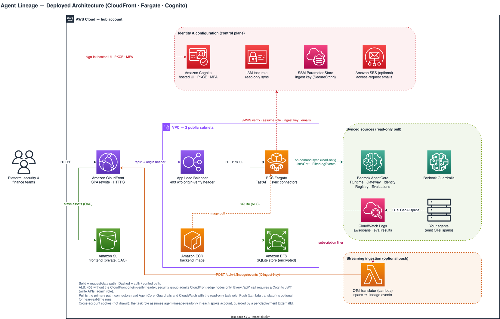

# Agent Lineage — The Map of Agents

Agent Lineage is an end-to-end provenance, governance, and cost visibility tool for
agentic AI platforms built on Amazon Bedrock AgentCore. It syncs read-only from your
AWS account and builds a living access graph — user groups → agents → sub-agents →
skills → gateways → tools → LLMs → resources — where every connection is classified
as **declared** (registered permission) or **observed** (proven by runtime traffic),
making unused privileges and access drift visible at a glance. Around that graph it
unifies the operational record: Cedar policy decisions per gateway, guardrail
interventions, identity and credential chains, online and on-demand evaluation
results, and full run trajectories rendered as execution graphs with token and
dollar cost attribution per agent and per model. It ships as a single CloudFormation
stack (CloudFront, Fargate, Cognito) with a React lineage UI — think
*"OpenLineage for agents."*

```
User Group → Agent → Sub-agents → Skills → Gateways → Tools / LLMs → Resources
```

Research and architecture analysis: [`docs/RESEARCH.md`](docs/RESEARCH.md) ·
Diagrams: [`deploy/architecture.drawio`](deploy/architecture.drawio),
[`deploy/data-ingestion-flow.drawio`](deploy/data-ingestion-flow.drawio)

## Architecture



Users sign in through Cognito (hosted UI, PKCE, TOTP MFA) and reach the React app
via CloudFront, which serves the SPA from a private S3 bucket (OAC) and forwards
`/api/*` to an ALB that answers 403 to anything without the CloudFront
origin-verify header. The FastAPI backend runs on ECS Fargate, persists the
lineage graph to SQLite on encrypted EFS, and syncs AWS data with a strictly
read-only IAM task role.

Data arrives on two paths:

- **Pull (primary)** — an admin-triggered sync reads Bedrock AgentCore (Runtime,
  Gateway, Identity, Registry, Evaluations), Bedrock Guardrails, and OTel GenAI
  spans from CloudWatch Logs (`aws/spans`).
- **Push (optional, near-real-time)** — the streaming-ingestion Lambda
  ([`integrations/otel_translator/handler.py`](integrations/otel_translator/handler.py))
  sits behind a CloudWatch Logs subscription filter and translates OTel GenAI
  spans into lineage run events (`invoke_agent` → START/COMPLETE/FAIL, `chat` →
  ACCESS with token usage, `execute_tool` → ACCESS). Events are POSTed to
  `/api/v1/lineage/events`, authenticated with the `X-Ingest-Key` service
  credential held in SSM Parameter Store.

Amazon SES is not part of ingestion: it is optional and only sends
access-request notification emails to admins when a viewer requests access to an
account (enabled via the `SesSenderEmail` stack parameter).

Editable diagram source: [`deploy/architecture.drawio`](deploy/architecture.drawio).

## Stack

- **Backend** — Python 3.12, FastAPI, SQLAlchemy (SQLite on EFS; Postgres-ready), boto3
- **Frontend** — React 18 + TypeScript, Vite, React Flow + dagre, light/dark themes
- **Deployment** — CloudFormation: CloudFront + S3 (OAC), ALB + ECS Fargate, EFS, Cognito

## Local quick start

```bash
# Backend (http://localhost:8000, docs at /docs)
cd backend
python3 -m venv .venv && .venv/bin/pip install -r requirements.txt
.venv/bin/python -m app.seed          # demo dataset (remove: python -m app.purge default)
.venv/bin/uvicorn app.main:app --port 8000 --reload

# Frontend (http://localhost:5173, proxies /api to the backend)
cd frontend
npm install
npm run dev
```

Locally, authentication is disabled and the "Connect AWS" button uses whatever
credentials the backend process has (env vars or the default profile chain).

## Deploying to an AWS account

Prerequisites: AWS CLI with deploy-capable credentials, Docker running, Node.js, openssl.

```bash
# 1. Confirm identity and target account
aws sts get-caller-identity

# 2a. Deploy creating a dedicated VPC
./deploy/deploy.sh us-west-2

# 2b. Or reuse an existing VPC (two PUBLIC subnets in different AZs, IGW-routed)
./deploy/deploy.sh us-west-2 vpc-xxxxxxxx subnet-aaaa,subnet-bbbb
```

The script builds and pushes the backend image to ECR, deploys/updates the
CloudFormation stack (`deploy/template.yaml`), builds the frontend, syncs it to S3,
and invalidates CloudFront. First deploy takes ~10 minutes (CloudFront); updates ~5–8.

```bash
# 3. Create your first user (self-signup is disabled by design)
aws cognito-idp admin-create-user \
  --user-pool-id <UserPoolId from stack outputs> \
  --username you@example.com \
  --user-attributes Name=email,Value=you@example.com Name=email_verified,Value=true \
  --region us-west-2
# Assign a role (required): admin manages syncs, ingestion and access requests;
# viewer gets read-only access scoped to granted accounts
aws cognito-idp admin-add-user-to-group --user-pool-id <UserPoolId> \
  --username you@example.com --group-name admin --region us-west-2
# Optional: set a permanent password directly
aws cognito-idp admin-set-user-password --user-pool-id <UserPoolId> \
  --username you@example.com --password 'YourStrongPassword123' --permanent --region us-west-2
```

4. Open the `AppUrl` stack output, log in, click **Connect AWS**, pick the region,
   leave profile/role empty (the Fargate task role is used automatically), and Sync.

What the stack secures: private S3 (OAC-only), ALB that answers 403 without the
CloudFront origin-verify header, Cognito JWT required on every API call, EFS
encrypted, and a read-only task IAM role for all AWS syncing.

## Sync role and required permissions

The sync is strictly read-only. The deployed stack creates the role automatically
(`agent-lineage-readonly-sync`, attached to the Fargate task); for local use or
cross-account syncing, create a role/user with this policy:

```json
{
  "Version": "2012-10-17",
  "Statement": [
    {
      "Sid": "AgentLineageReadOnlySync",
      "Effect": "Allow",
      "Action": [
        "bedrock-agentcore:List*",
        "bedrock-agentcore:Get*",
        "bedrock:ListGuardrails",
        "bedrock:GetGuardrail",
        "logs:FilterLogEvents",
        "logs:DescribeLogGroups"
      ],
      "Resource": "*"
    }
  ]
}
```

What each permission feeds: `bedrock-agentcore` List/Get covers AgentCore Runtime
agents, Gateways + targets, Identity (workload identities, credential providers —
metadata only, never secret values), Registry records, and Evaluations;
`bedrock:*Guardrail*` covers guardrail nodes; `logs:FilterLogEvents` reads OTel
GenAI spans from `aws/spans` (runs, tokens, cost) and online-evaluation result
log groups.

**Cross-account (hub-and-spoke):** create the role above in each spoke account with
a trust policy allowing the hub's task role to assume it, then enter the spoke role
ARN in the Connect AWS modal.

The trust policy must require your deployment's **ExternalId** (confused-deputy
guard). Each deployment generates its own unique value at stack creation — it is
deliberately not printed here. **Never publish it**; retrieve it with:

```bash
aws cloudformation describe-stacks --stack-name agent-lineage --region <region> \
  --query "Stacks[0].Parameters[?ParameterKey=='SyncExternalId'].ParameterValue" --output text
```

```json
{
  "Version": "2012-10-17",
  "Statement": [
    {
      "Effect": "Allow",
      "Principal": { "AWS": "arn:aws:iam::HUB_ACCOUNT_ID:role/agent-lineage-readonly-sync" },
      "Action": "sts:AssumeRole",
      "Condition": { "StringEquals": { "sts:ExternalId": "<YOUR_DEPLOYMENT_EXTERNAL_ID>" } }
    }
  ]
}
```

The hub automatically sends this ExternalId on every cross-account AssumeRole call
(`SYNC_EXTERNAL_ID` env var, set by the stack). For locally-run syncs, pass
`external_id` in the Connect AWS request instead.

Note: the hub task role additionally needs `sts:AssumeRole` on
`arn:aws:iam::*:role/agent-lineage-readonly` — not included in the stack by default
(single-account deployments stay minimal); add it when enabling spokes.

## Roles and trust model

Two personas, enforced via Cognito user-pool groups:

| | **Admin** (`admin` group) | **Viewer** (everyone else) |
|---|---|---|
| Read lineage, runs, costs, audit logs | ✔ All namespaces | ✔ Only granted accounts (`custom:allowed_namespaces`) |
| Trigger AWS / registry sync, recompute costs | ✔ | ✘ |
| Write APIs (`POST /nodes`, `/edges`, `/lineage/events`, `/evaluations`) | ✔ | ✘ |
| Delete namespaces | ✔ | ✘ |
| Approve/reject access requests | ✔ | Can submit requests only |

Viewers with no grants see an in-app access-request form; admins are notified by
email (SES, optional) and approve in-app, which writes the account grant to the
requester's Cognito profile. Locally (no Cognito env vars) auth is disabled and
everything runs as an unrestricted admin.

**Trust model for governance records.** Cedar decisions, guardrail interventions,
run trajectories and token/cost figures reflect **what the reporting pipeline
observed and reported — they are not independently attested facts**. AgentCore
Gateway and Bedrock Guardrails do not emit signed decision records, so Agent
Lineage cannot cryptographically verify a claimed ALLOW/DENY or BLOCKED/PASSED
against the control plane that made it. What bounds the risk:

- **Write access is admin-only.** All ingestion endpoints require the admin role;
  viewers cannot create or alter audit records.
- **The primary data path is pull, not push.** In a deployed stack, records come
  from the read-only, IAM-authenticated sync of AWS-generated telemetry
  (CloudWatch OTel spans, service APIs) — not from caller-supplied payloads.
- Records ingested via `POST /api/v1/lineage/events` carry whatever the producer
  claimed. Treat them as operational evidence, not as a tamper-proof audit trail;
  platform admins are trusted by design.

## Core concepts

| Concept | Description |
|---|---|
| **Node** | `user_group`, `agent`, `skill`, `prompt`, `identity`, `credential`, `gateway`, `guardrail`, `tool`, `llm`, `resource` |
| **Edge** | `INVOKES`, `DELEGATES_TO`, `HAS_SKILL`, `USES_PROMPT`, `AUTHENTICATES_AS`, `USES_CREDENTIAL`, `GRANTS_ACCESS_TO`, `USES_TOOL`, `CALLS_LLM`, `ACCESSES`, `ROUTES_TO`, `GUARDED_BY` |
| **Origin** | `declared` (registry/config), `observed` (runtime), `both` — the delta powers least-privilege analysis |
| **Gateway** | Carries its Cedar policies; per-call ALLOW/DENY decisions are logged and accumulated on edges |
| **Run / Event** | OpenLineage-style run events (`START`/`ACCESS`/`COMPLETE`/`FAIL`), mapped from OTel GenAI spans; failures carry exception details; each run links to its CloudWatch trace |
| **Facets** | Free-form JSON metadata on any node, edge or run |
| **Namespace** | `account/region` — multiple accounts/regions coexist in one graph |

## Key API endpoints

| Endpoint | Role | Purpose |
|---|---|---|
| `POST /api/v1/aws/sync` | admin | Pull real data from an AWS account (region + optional profile/role ARN) |
| `POST /api/v1/lineage/events` | admin | Ingest observed runtime events (OTel-compatible; incl. token usage, gateway calls, guardrail events) |
| `POST /api/v1/nodes`, `POST /api/v1/edges` | admin | Register declared lineage (catalog nodes, permissions) |
| `POST /api/v1/evaluations` | admin | Record evaluation results |
| `DELETE /api/v1/namespaces/{ns}` | admin | Purge one namespace (e.g. the demo dataset) |
| `GET /api/v1/lineage/graph?node_id=&depth=` | any | Directional lineage graph; repeat `node_id` for multi-focus |
| `GET /api/v1/search?q=` | any | Cross-type catalog search (agents, tools, skills, gateways, LLMs…) |
| `GET /api/v1/runs`, `GET /api/v1/runs/{id}/timeline` | any | Paginated run history with cost rollups; per-run trajectory |
| `GET /api/v1/costs/{agent_id}`, `GET /api/v1/llm-stats` | any | Cost attribution per agent / per model (time-windowed) |
| `GET /api/v1/cedar-decisions`, `GET /api/v1/guardrail-interventions` | any | Governance audit logs |
| `GET /api/v1/evaluations?agent_id=` | any | Online + on-demand evaluation results |
| `POST /api/v1/access-requests` | any | Request viewer access to an account (admin approves in-app) |

"any" = any authenticated user; viewer reads are additionally scoped to their
granted accounts. Locally (auth disabled) all endpoints are open.

## Notes

- Cost is derived from token usage via each LLM node's `pricing_per_1k` facet, with a
  built-in pricing catalog fallback; `POST /api/v1/costs/recompute` backfills.
- The spans/eval lookback windows default to 30 days
  (`AGENT_LINEAGE_SPANS_WINDOW_HOURS`, `AGENT_LINEAGE_EVAL_RESULTS_WINDOW_HOURS`).
- Streaming ingestion skeleton: `integrations/otel_translator/handler.py`
  (CloudWatch Logs subscription → lineage events), for when pull-based sync isn't fresh enough.
